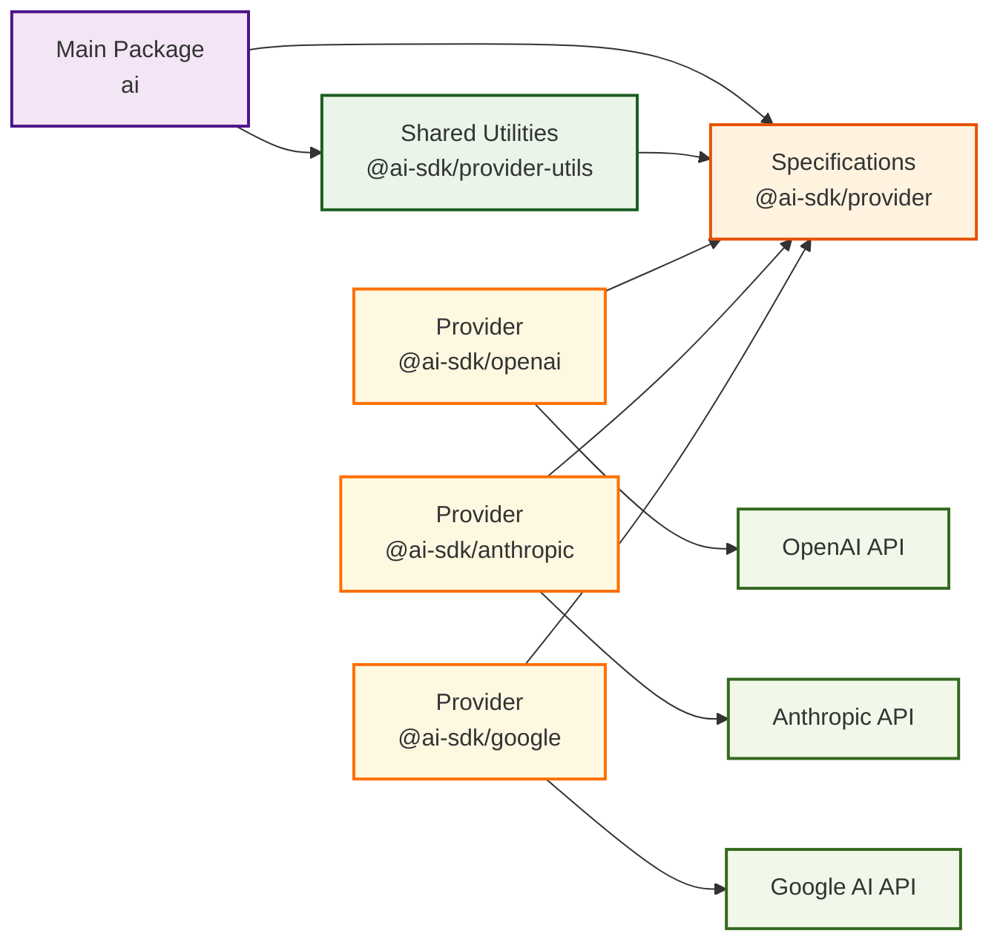
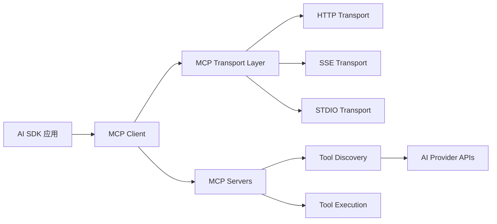

# Vercel AI SDK - 深度分析

> **官方网站**: https://ai-sdk.dev/
> **GitHub**: https://github.com/vercel/ai
> **当前版本**: v5.0（v6 Beta已发布）
> **维护团队**: Vercel

---

## 📌 项目概述

Vercel AI SDK 是一个专为 TypeScript 设计的 AI 应用开发工具包，由 Next.js 的创建团队 Vercel 开发。它提供了一个统一、跨提供商的 API，让开发者能够轻松地在各种应用程序中集成 AI 功能。

**核心理念**: 标准化 AI 模型集成，让开发者专注于构建应用而非处理不同提供商的技术细节。

**关键口号**: "From the creators of Next.js, the AI SDK is a free open-source library that gives you the tools you need to build AI-powered products."

---

## 🎯 核心价值主张

### 与直接使用API的对比

| 方面 | 直接使用API | Vercel AI SDK |
|------|-------------|---------------|
| **提供商切换** | 需要重写大量代码 | 一行代码切换 |
| **错误处理** | 各自实现 | 统一的错误处理 |
| **流式响应** | 复杂的解析逻辑 | 内置标准化处理 |
| **类型安全** | 基础或无 | 完整TypeScript支持 |
| **多模态支持** | 分散的实现 | 统一的接口 |
| **工具调用** | 各自的格式 | 标准化的工具API |

### 适用场景

- ✅ 快速原型开发和MVP构建
- ✅ 需要切换/比较不同AI模型的应用
- ✅ 生产级AI应用开发
- ✅ 多模态AI功能集成
- ✅ 聊天机器人和对话式AI
- ✅ 结构化数据生成和处理

---

## 🏗️ 技术架构

### 整体架构设计

```
┌─────────────────────────────────────────────────────────────┐
│                    应用层 (Applications)                  │
├─────────────────────────────────────────────────────────────┤
│  AI SDK UI          │  AI SDK RSC       │  Custom Hooks │
│  - useChat          │  - streamUI       │  - 自定义hooks │
│  - useObject        │  - createAI       │               │
│  - useCompletion    │                   │               │
├─────────────────────────────────────────────────────────────┤
│                   AI SDK Core                          │
│  - generateText     │  - generateObject  │  - streamText  │
│  - generateObject   │  - tool           │  - streamObject │
│  - stepTool        │  - streamUI        │               │
├─────────────────────────────────────────────────────────────┤
│                Provider Layer (提供商层)                    │
│  OpenAI │ Anthropic │ Google │ xAI │ Groq │ Custom...    │
├─────────────────────────────────────────────────────────────┤
│              Infrastructure (基础设施层)                      │
│  Vercel AI Gateway │ 自定义API │ 云服务提供商            │
└─────────────────────────────────────────────────────────────┘
```

### Provider 架构



### 核心模块详解

#### 1. AI SDK Core
```typescript
// 核心功能函数
import {
  generateText,    // 一次性文本生成
  streamText,      // 流式文本生成
  generateObject,  // 结构化数据生成
  streamObject,    // 流式结构化数据
  stepTool,       // 工具调用执行
  streamUI        // 生成式UI流
} from 'ai';

// 基础用法示例
const result = await generateText({
  model: openai('gpt-4o'),
  prompt: 'Explain quantum computing',
});
```

#### 2. AI SDK UI
```typescript
// React hooks
import { useChat, useObject, useCompletion } from '@ai-sdk/react';

function ChatComponent() {
  const { messages, input, handleInputChange, handleSubmit } = useChat();

  return (
    <div>
      {messages.map(m => <div key={m.id}>{m.content}</div>)}
      <form onSubmit={handleSubmit}>
        <input value={input} onChange={handleInputChange} />
      </form>
    </div>
  );
}
```

#### 3. Provider 系统
```typescript
// 支持的提供商
import { openai } from '@ai-sdk/openai';
import { anthropic } from '@ai-sdk/anthropic';
import { google } from '@ai-sdk/google';
import { xai } from '@ai-sdk/xai';
import { groq } from '@ai-sdk/groq';

// 统一的使用方式
const models = {
  gpt4: openai('gpt-4o'),
  claude: anthropic('claude-3-5-sonnet-20241022'),
  gemini: google('gemini-1.5-pro'),
  grok: xai('grok-4'),
  llama: groq('llama-3-70b-8192'),
};
```

---

## 💻 技术实现细节

### 安装与配置

```bash
# 核心包安装
npm install ai @ai-sdk/react @ai-sdk/openai

# 或使用其他包管理器
pnpm add ai @ai-sdk/react @ai-sdk/openai
yarn add ai @ai-sdk/react @ai-sdk/openai
bun add ai @ai-sdk/react @ai-sdk/openai
```

### 环境配置
```env
# .env.local
OPENAI_API_KEY=your_openai_api_key
ANTHROPIC_API_KEY=your_anthropic_api_key
GOOGLE_GENERATIVE_AI_API_KEY=your_google_api_key
```

### 基础使用模式

#### 1. 文本生成
```typescript
import { generateText } from 'ai';
import { openai } from '@ai-sdk/openai';

const { text } = await generateText({
  model: openai('gpt-4o'),
  prompt: 'Write a poem about artificial intelligence',
  temperature: 0.7,
  maxTokens: 500,
});
```

#### 2. 流式文本生成
```typescript
import { streamText } from 'ai';
import { openai } from '@ai-sdk/openai';

const { textStream } = await streamText({
  model: openai('gpt-4o'),
  prompt: 'Tell me a story',
});

for await (const textPart of textStream) {
  console.log(textPart);
}
```

#### 3. 结构化数据生成
```typescript
import { generateObject } from 'ai';
import { openai } from '@ai-sdk/openai';
import { z } from 'zod';

const { object } = await generateObject({
  model: openai('gpt-4o'),
  prompt: 'Generate a user profile',
  schema: z.object({
    name: z.string(),
    age: z.number(),
    email: z.string().email(),
    interests: z.array(z.string()),
  }),
});
```

#### 4. 工具调用
```typescript
import { generateText, tool } from 'ai';
import { openai } from '@ai-sdk/openai';
import { z } from 'zod';

const weatherTool = tool({
  description: 'Get the weather for a location',
  parameters: z.object({
    location: z.string().describe('The location to get weather for'),
    unit: z.enum(['celsius', 'fahrenheit']).default('celsius'),
  }),
  execute: async ({ location, unit }) => {
    // 实际的天气API调用
    return { location, temperature: 22, condition: 'Sunny' };
  },
});

const result = await generateText({
  model: openai('gpt-4o'),
  prompt: 'What is the weather like in Tokyo?',
  tools: {
    getWeather: weatherTool,
  },
});
```

---

## 🔄 高级功能特性

### 1. 生成式UI (Generative UI)

```typescript
import { streamUI } from 'ai';
import { openai } from '@ai-sdk/openai';

const { text, delta } = await streamUI({
  model: openai('gpt-4o'),
  prompt: 'Create a user interface',
  text: ({ content }) => <div>{content}</div>,
  tools: {
    showUserCard: {
      description: 'Show a user card',
      parameters: z.object({
        name: z.string(),
        email: z.string().email(),
      }),
      generate: async ({ name, email }) => {
        return <UserCard name={name} email={email} />;
      },
    },
  },
});
```

### 2. 多模态支持

```typescript
// 图像输入
const result = await generateText({
  model: openai('gpt-4o'),
  prompt: 'Describe what you see in this image',
  messages: [
    {
      role: 'user',
      content: [
        { type: 'text', text: 'Describe this image' },
        {
          type: 'image',
          image: new URL('https://example.com/image.jpg')
        },
      ],
    },
  ],
});
```

### 3. Provider Registry (提供商注册)

```typescript
import { createProviderRegistry } from 'ai';
import { anthropic, openai } from '@ai-sdk/openai';

export const registry = createProviderRegistry({
  // 预设提供商
  openai: openai({
    apiKey: process.env.OPENAI_API_KEY,
  }),

  // 自定义别名
  models: {
    'fast': anthropic('claude-3-haiku-20240307'),
    'reasoning': openai('o1-preview'),
    'creative': openai('gpt-4o'),
  },
});

// 使用
const model = registry.languageModel('creative');
```

### 4. 中间件支持

```typescript
import { defaultSettingsMiddleware, wrapLanguageModel } from 'ai';

const wrappedModel = wrapLanguageModel({
  model: openai('gpt-4o'),
  middleware: defaultSettingsMiddleware({
    settings: {
      maxTokens: 100000,
      providerOptions: {
        anthropic: {
          thinking: {
            type: 'enabled',
            budgetTokens: 32000,
          },
        },
      },
    },
  }),
});
```

### 5. MCP工具集成 (Model Context Protocol)

#### MCP架构设计
AI SDK 通过 `experimental_createMCPClient` 提供了对 Model Context Protocol 的原生支持：



#### MCP传输方式

**1. HTTP传输（生产推荐）**
```typescript
import { experimental_createMCPClient } from '@ai-sdk/mcp';
import { StreamableHTTPClientTransport } from '@modelcontextprotocol/sdk/client/streamableHttp';

const mcpClient = await experimental_createMCPClient({
  transport: new StreamableHTTPClientTransport(
    new URL('https://your-server.com/mcp'), {
      sessionId: 'session_123',
      headers: { Authorization: 'Bearer token' },
    }
  ),
});
```

**2. SSE传输（Server-Sent Events）**
```typescript
import { experimental_createMCPClient } from '@ai-sdk/mcp';

const mcpClient = await experimental_createMCPClient({
  transport: {
    type: 'sse',
    url: 'https://my-server.com/sse',
    headers: { Authorization: 'Bearer token' },
  },
});
```

**3. STDIO传输（仅本地开发）**
```typescript
import { experimental_createMCPClient } from '@ai-sdk/mcp';
import { Experimental_StdioMCPTransport } from '@ai-sdk/mcp';

const mcpClient = await experimental_createMCPClient({
  transport: new Experimental_StdioMCPTransport({
    command: 'node',
    args: ['mcp-server.js'],
    env: { API_KEY: 'your-key' },
  }),
});
```

#### MCP工具使用模式

**Schema Discovery模式**
```typescript
// 自动发现服务器提供的所有工具
const tools = await mcpClient.tools();
// 自动类型推断，无需手动定义
```

**Schema Definition模式**
```typescript
import { z } from 'zod';

// 明确定义工具schema，提供类型安全
const tools = await mcpClient.tools({
  schemas: {
    'get-user': {
      inputSchema: z.object({
        userId: z.string().describe('用户ID'),
        includeProfile: z.boolean().default(false),
      }),
    },
  },
});
```

#### MCP vs 普通工具调用对比

| 特性 | 普通工具调用 | MCP工具集成 |
|------|-------------|--------------|
| **工具发现** | 手动定义每个工具 | 自动发现服务器工具 |
| **标准化** | 各Provider自定义格式 | MCP统一标准协议 |
| **多服务器** | 需要多个Provider配置 | 一个客户端连接多个服务器 |
| **实时性** | 轮询或手动刷新 | 事件驱动的变更通知 |
| **版本管理** | 手动同步工具变更 | 自动处理工具版本和废弃 |
| **安全** | 依赖Provider实现 | MCP标准安全模型 |

#### 实际应用示例
```typescript
// 结合多个MCP服务器
const config = {
  mcpServers: {
    weather: {
      url: 'https://weather-api.com/mcp',
      transport: 'http'
    },
    database: {
      command: 'node',
      args: ['db-server.js'],
      transport: 'stdio'
    }
  }
};

const client = new Client(config);

async with client {
  // 工具按服务器命名空间
  const weatherData = await client.call_tool("weather_get_forecast", {"city": "NYC"});
  const dbResult = await client.call_tool("database_query", {"table": "users"});
}
```

#### MCP生态系统

**主流MCP服务器示例**:
- **GitHub**: 代码仓库管理、问题追踪
- **Joplin**: 笔记管理和搜索
- **PostgreSQL**: 数据库查询和操作
- **Slack**: 消息发送和频道管理
- **Google Calendar**: 日程安排和事件管理
- **Custom APIs**: 任何REST API都可封装为MCP服务

**MCP的核心价值**:
- 🔄 **标准化**: 一次编写，多处复用
- 🛡️ **安全性**: 统一的身份验证和权限模型
- 📈 **可扩展**: 支持工具的动态发现和更新
- 🎯 **类型安全**: 完整的TypeScript支持
- 🚀 **生产就绪**: HTTP传输、错误处理、连接管理

---

## 📊 支持的提供商

### 官方支持的提供商

| 提供商 | 包名 | 支持功能 |
|--------|------|----------|
| **OpenAI** | `@ai-sdk/openai` | ✅ 全功能支持 |
| **Anthropic** | `@ai-sdk/anthropic` | ✅ 全功能支持 |
| **Google** | `@ai-sdk/google` | ✅ 全功能支持 |
| **xAI** | `@ai-sdk/xai` | ✅ 全功能支持 |
| **Groq** | `@ai-sdk/groq` | ✅ 基础功能 |
| **Azure** | `@ai-sdk/azure` | ✅ 企业级功能 |
| **Mistral** | `@ai-sdk/mistral` | ✅ 基础功能 |
| **Cohere** | `@ai-sdk/cohere` | ✅ 工具调用 |

### 功能支持矩阵

| 功能 | OpenAI | Anthropic | Google | xAI | Groq |
|------|--------|----------|---------|-----|------|
| **文本生成** | ✅ | ✅ | ✅ | ✅ | ✅ |
| **流式响应** | ✅ | ✅ | ✅ | ✅ | ✅ |
| **工具调用** | ✅ | ✅ | ✅ | ✅ | ✅ |
| **图像输入** | ✅ | ✅ | ✅ | ❌ | ❌ |
| **图像生成** | ✅ | ❌ | ✅ | ❌ | ❌ |
| **结构化输出** | ✅ | ✅ | ✅ | ✅ | ✅ |
| **工具流式传输** | ✅ | ✅ | ✅ | ✅ | ❌ |

---

## 🎨 实际应用模式

### 1. 聊天机器人
```typescript
// app/api/chat/route.ts
import { openai } from '@ai-sdk/openai';
import { StreamingTextResponse } from 'ai';

export async function POST(req: Request) {
  const { messages } = await req.json();

  const result = await streamText({
    model: openai('gpt-4o'),
    messages,
  });

  return result.toDataStreamResponse();
}
```

### 2. RAG 系统
```typescript
import { generateText } from 'ai';
import { openai } from '@ai-sdk/openai';

async function ragQuery(query: string) {
  // 1. 检索相关文档
  const context = await retrieveRelevantDocs(query);

  // 2. 生成回答
  const { text } = await generateText({
    model: openai('gpt-4o'),
    prompt: `Context: ${context}\n\nQuestion: ${query}`,
    system: 'Answer based on the provided context.',
  });

  return text;
}
```

### 3. 多步工作流
```typescript
import { generateObject, tool } from 'ai';
import { openai } from '@ai-sdk/openai';
import { z } from 'zod';

const analysisTool = tool({
  parameters: z.object({
    data: z.string(),
    analysisType: z.enum(['sentiment', 'topics', 'entities']),
  }),
  execute: async ({ data, analysisType }) => {
    // 执行分析逻辑
    return analyzeData(data, analysisType);
  },
});

const workflow = async (input: string) => {
  // 第一步：选择分析类型
  const { object: step1 } = await generateObject({
    model: openai('gpt-4o'),
    prompt: `Analyze this input and choose analysis type: ${input}`,
    schema: z.object({
      analysisType: z.enum(['sentiment', 'topics', 'entities']),
      reasoning: z.string(),
    }),
  });

  // 第二步：执行分析
  const { text: step2 } = await generateText({
    model: openai('gpt-4o'),
    prompt: `Perform ${step1.analysisType} analysis on: ${input}`,
    tools: { analyze: analysisTool },
  });

  return { step1, step2 };
};
```

---

## 🔥 核心优势

### 1. **开发效率**
- "从想法到可运行的AI应用只需15分钟"
- 10倍提升LLM开发体验
- 丰富的模板和示例

### 2. **类型安全**
- 完整的TypeScript支持
- 编译时错误检查
- 智能代码提示

### 3. **生产就绪**
- 内置错误处理和重试机制
- 流量限制和成本控制
- 可观测性和监控支持

### 4. **生态系统**
- 超过2000个代码示例
- 活跃的社区支持
- 与Vercel平台深度集成

### 5. **可扩展性**
- 插件式的提供商架构
- 支持自定义中间件
- 灵活的配置选项

---

## ⚠️ 局限性分析

### 1. **学习曲线**
- 虽然基础用法简单，但高级功能需要理解整个架构
- 不同提供商的参数配置差异较大

### 2. **版本迭代**
- v5到v6的迁移可能需要代码修改
- Beta版本的API可能不稳定

### 3. **依赖管理**
- 需要为每个提供商安装单独的包
- 可能导致包体积较大

### 4. **提供商限制**
- 某些高级功能（如工具流式传输）不是所有提供商都支持
- 部分新兴AI模型集成可能滞后

### 5. **成本考虑**
- 流式响应和复杂功能可能导致API调用成本增加
- 需要 careful 的使用量管理

---

## 🚀 实际项目集成

### Next.js 项目集成
```typescript
// app/layout.tsx
import { AI } from './lib/ai';

export default function RootLayout({
  children,
}: {
  children: React.ReactNode;
}) {
  return (
    <html>
      <body>
        <AI>{children}</AI>
      </body>
    </html>
  );
}
```

### 自定义Provider示例
```typescript
// lib/ai.ts
import { createOpenAI } from '@ai-sdk/openai';
import { anthropic } from '@ai-sdk/anthropic';
import { createProviderRegistry } from 'ai';

export const registry = createProviderRegistry({
  openai: createOpenAI({
    apiKey: process.env.OPENAI_API_KEY,
    baseURL: process.env.OPENAI_BASE_URL,
  }),

  anthropic: anthropic({
    apiKey: process.env.ANTHROPIC_API_KEY,
  }),
});

export const AI = createAI({
  provider: registry,
  model: 'openai:gpt-4o',
});
```

---

## 💡 最佳实践

### 1. **错误处理**
```typescript
try {
  const result = await generateText({
    model: openai('gpt-4o'),
    prompt: 'Your prompt here',
  });

  console.log(result.text);
} catch (error) {
  if (error instanceof AISDKError) {
    console.error('AI SDK Error:', error.message);
  } else {
    console.error('Unexpected error:', error);
  }
}
```

### 2. **成本控制**
```typescript
const result = await generateText({
  model: openai('gpt-4o'),
  prompt: 'Your prompt here',
  maxTokens: 1000,  // 限制输出长度
  temperature: 0.1,  // 使用较低温度减少随机性
});
```

### 3. **响应式设计**
```typescript
// 根据设备类型选择不同模型
const model = isMobile ?
  openai('gpt-4o-mini') :
  openai('gpt-4o');
```

### 4. **缓存策略**
```typescript
// 使用外部缓存
const cacheKey = `generate:${promptHash}`;
const cached = await redis.get(cacheKey);

if (cached) {
  return JSON.parse(cached);
}

const result = await generateText({
  model: openai('gpt-4o'),
  prompt,
});

await redis.setex(cacheKey, 3600, JSON.stringify(result));
```

---

## 🔮 发展趋势

### v6 Beta 新特性
1. **增强的工具流式传输** - 更流畅的工具调用体验
2. **改进的RAG支持** - 内置检索增强生成模式
3. **更好的多模态** - 增强的图像和音频处理
4. **性能优化** - 更低的延迟和更高的吞吐量

### 生态扩展
1. **更多提供商支持** - 持续增加新的AI模型
2. **企业级功能** - 更多商业化和企业特性
3. **开发工具** - 更好的调试和监控工具
4. **社区贡献** - 更多第三方插件和扩展

---

## 📚 学习资源

### 官方资源
- **文档**: https://ai-sdk.dev/docs
- **Cookbook**: https://ai-sdk.dev/docs/cookbook
- **Playground**: https://ai-sdk.dev/playground
- **GitHub**: https://github.com/vercel/ai

### 社区资源
- **Discord**: 官方Discord社区
- **GitHub Discussions**: 技术讨论和问题解答
- **模板库**: 丰富的启动模板

### 推荐学习路径
1. **基础入门** - 从generateText开始
2. **UI组件** - 学习useChat和useObject
3. **高级功能** - 掌握工具调用和流式UI
4. **生产部署** - 了解错误处理和监控
5. **自定义扩展** - 创建自定义提供商和中间件

---

## 🎓 总结

Vercel AI SDK 代表了当前AI应用开发的最佳实践和标准化方向。它通过统一的接口、丰富的功能和优秀的开发者体验，极大地简化了AI应用的构建过程。

**核心价值**:
- 🚀 **开发效率** - 快速原型和迭代
- 🔧 **灵活性** - 多提供商支持，轻松切换
- 🛡️ **稳定性** - 生产级的错误处理和监控
- 📈 **可扩展** - 模块化架构，易于扩展
- 🎯 **类型安全** - 完整的TypeScript支持

**适合人群**:
- 🧑‍💻 全栈开发者（特别是React/Next.js生态）
- 🚀 快速原型开发者
- 🔬 AI产品实验者
- 🏢 企业AI应用开发团队

**推荐场景**:
- 聊天机器人和对话式AI
- 内容生成和处理
- 数据分析和洞察
- 自动化工作流
- 多模态AI应用

AI SDK 正在成为AI应用开发的事实标准，值得每个现代Web开发者掌握。它不仅提高了开发效率，更重要的是建立了一套标准的开发模式和最佳实践。

---

*分析完成时间: 2025-10-27*
*SDK版本: v5.0.0 (v6 Beta)*