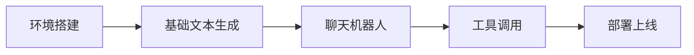
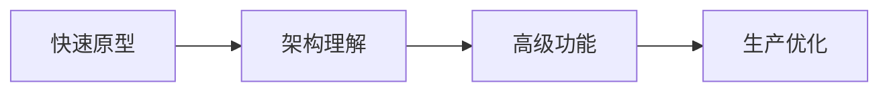
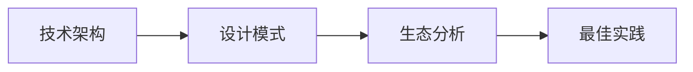

# Vercel AI SDK 专题 📚

> Vercel AI SDK 是现代 AI 应用开发的标准化工具包，本专题包含从技术深度分析到实际使用的完整资料。

---

## 📋 文档目录

### 📖 [01-技术深度分析](./01-技术深度分析.md)
- **适合人群**: 技术架构师、AI研究者、深度学习者
- **内容**: 详细的架构分析、核心特性、技术实现细节
- **难度**: ⭐⭐⭐⭐⭐ (高级)

### 🚀 [02-快速上手指南](./02-快速上手指南.md)
- **适合人群**: 前端开发者、快速原型开发者、AI初学者
- **内容**: 从零开始构建AI应用的step-by-step教程
- **难度**: ⭐⭐☆☆☆ (初级)

---

## 🎯 如何选择文档

| 你的目标 | 推荐文档 | 预计时间 |
|---------|-----------|----------|
| **快速开始构建AI应用** | [02-快速上手指南](./02-快速上手指南.md) | 15-30分钟 |
| **理解AI SDK的架构设计** | [01-技术深度分析](./01-技术深度分析.md) | 1-2小时 |
| **评估是否使用AI SDK** | 02-快速上手指南 → 01-技术深度分析 | 2-3小时 |
| **深度掌握高级功能** | 01-技术深度分析 | 3+小时 |

---

## 🔥 核心亮点

### 🎪 [快速上手指南] 特色
- ⚡ **极速上手**: 3分钟搭建环境，12分钟掌握核心功能
- 💻 **立即可用**: 所有代码完整、可运行，包含UI设计
- 🛠️ **实用功能**: 文本生成、聊天机器人、结构化数据、工具调用
- 🚀 **部署就绪**: 一键部署到Vercel等平台

### 🏗️ [技术分析] 特色
- 📊 **深度架构**: 多层次的Provider架构设计分析
- 🎯 **核心价值**: 与传统方案的详细对比
- 💡 **技术洞察**: 2000+行的代码示例和技术细节
- 📈 **发展趋势**: v6 Beta新特性和未来方向

---

## 🎯 学习路径建议

### 🔰 新手入门路径


**推荐阅读**: [02-快速上手指南](./02-快速上手指南.md) 全程

### 🔧 进阶开发者路径


**推荐阅读**:
1. [02-快速上手指南](./02-快速上手指南.md) (快速了解)
2. [01-技术深度分析](./01-技术深度分析.md) (深度掌握)

### 🏛️ 架构师路径


**推荐阅读**:
1. [01-技术深度分析](./01-技术深度分析.md) (重点章节)
2. 补充官方文档和源码

---

## 💡 核心概念快速参考

### 🎨 AI SDK 四个核心模块
```typescript
// 1. AI SDK Core - 核心功能
import { generateText, streamText, generateObject } from 'ai';

// 2. AI SDK UI - React hooks
import { useChat, useObject } from '@ai-sdk/react';

// 3. Provider系统 - 多AI提供商
import { openai, anthropic } from '@ai-sdk/openai';

// 4. MCP工具集成 - 标准化工具接入
import { experimental_createMCPClient } from '@ai-sdk/mcp';
import { Experimental_StdioMCPTransport } from '@ai-sdk/mcp';
```

### 🔄 统一的提供商API
```typescript
// 一行代码切换模型
const models = {
  gpt4: openai('gpt-4o'),
  claude: anthropic('claude-3-5-sonnet-20241022'),
  gemini: google('gemini-1.5-pro'),
};

// 统一的使用方式
await generateText({ model: models.gpt4, prompt: 'Hello' });
await generateText({ model: models.claude, prompt: 'Hello' });
```

### 🎯 核心功能矩阵
| 功能 | 核心函数 | 用途 | 复杂度 |
|------|----------|------|--------|
| **文本生成** | `generateText` | 一次性文本生成 | ⭐ |
| **流式文本** | `streamText` | 实时流式输出 | ⭐⭐ |
| **结构化数据** | `generateObject` | JSON/对象生成 | ⭐⭐ |
| **聊天机器人** | `useChat` | 对话式AI | ⭐⭐ |
| **工具调用** | `tool()` | 外部能力集成 | ⭐⭐⭐ |

---

## 🔗 相关资源

### 📚 官方资源
- **AI SDK 官网**: https://ai-sdk.dev/
- **GitHub 仓库**: https://github.com/vercel/ai
- **在线 Playground**: https://ai-sdk.dev/playground
- **API 文档**: https://ai-sdk.dev/docs

### 🛠️ 实用工具
- **Code Templates**: 快速启动模板
- **Provider比较**: 不同AI模型功能对比
- **成本计算器**: AI使用成本估算

### 🎯 实战项目
- **聊天机器人**: 全功能对话AI
- **RAG系统**: 检索增强生成
- **多模态应用**: 图文音视频处理
- **AI Agent**: 自主任务执行

---

## 📊 学习时间估算

| 场景 | 快速上手 | 深度分析 | 总计 |
|------|----------|----------|------|
| **快速原型开发者** | 30分钟 | 1小时 | 1.5小时 |
| **全栈开发者** | 1小时 | 2小时 | 3小时 |
| **AI架构师** | 30分钟 | 4小时 | 4.5小时 |
| **研究者** | 1小时 | 6小时+ | 7小时+ |

---

## 🎉 开始你的AI开发之旅

### 🏃‍♂️ 立即开始
如果你现在就想看到AI应用运行效果：

```bash
# 1. 创建项目
npx create-next-app@latest my-ai-app --typescript
cd my-ai-app

# 2. 安装SDK
npm install ai @ai-sdk/react @ai-sdk/openai

# 3. 运行示例
# 参考 [02-快速上手指南](./02-快速上手指南.md) 中的代码
```

### 🎯 深度理解
如果你想彻底理解AI SDK的设计哲学和架构选择：

1. 通读 [01-技术深度分析](./01-技术深度分析.md) 的核心章节
2. 理解Provider架构设计
3. 分析多模态和工具调用的实现

---

## 💬 社区讨论

有问题？欢迎交流：

- **GitHub Issues**: https://github.com/vercel/ai/issues
- **Discord社区**: Vercel官方Discord
- **技术讨论**: 在项目中实践并分享经验

---

**最后更新**: 2025-10-27
**AI SDK版本**: v5.0+ (v6 Beta)
**维护者**: AI-Ideas Project Team

---

🚀 **AI SDK正在重新定义AI应用开发，现在就开始学习吧！**